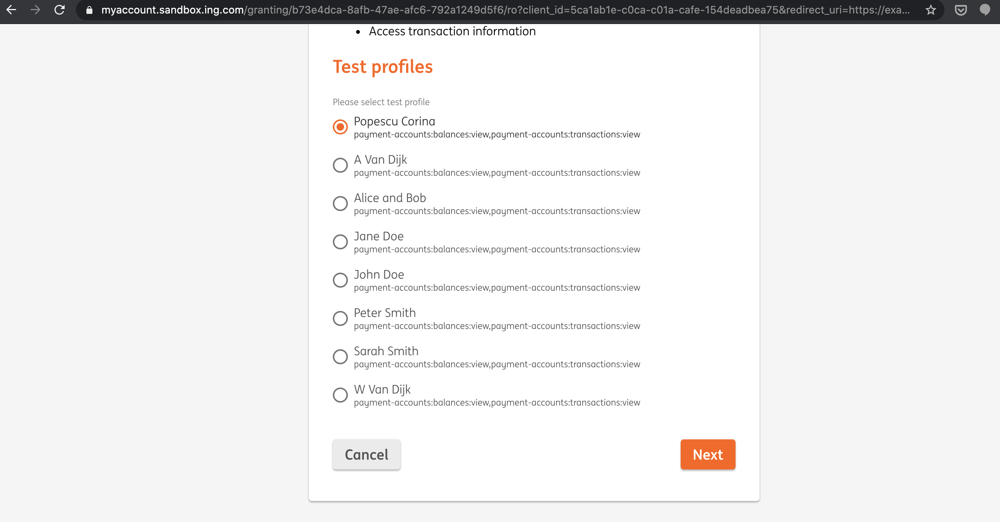
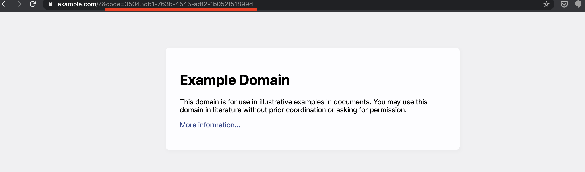

# ing-client
Sample Spring Boot project to consume ING APIs using [this sdk](https://github.com/danlucian/ing-psd2-oauth2-sdk)

## Setup

To call the ING (sandbox) environment one should configure the properties below:

```properties
ing.debug=true
ing.key-id=5ca1ab1e-c0ca-c01a-cafe-154deadbea75
ing.host=https://api.sandbox.ing.com
ing.redirect-back-url=https://example.com
ing.scopes=payment-accounts%3Abalances%3Aview%20payment-accounts%3Atransactions%3Aview
ing.clientCertificate=classpath:sandbox/example_eidas_client_tls.cer
ing.clientKey=classpath:sandbox/example_eidas_client_tls.key
ing.signingCertificate=classpath:sandbox/example_eidas_client_signing.cer
ing.signingKey=classpath:sandbox/example_eidas_client_signing.key
```

There are a few endpoints to use for this sample application:

* Get the login url for the customer to authenticate

```shell script
curl -X GET \
  http://localhost:8080/grants \
  -H 'Accept: */*' \
  -H 'Accept-Encoding: gzip, deflate' \
  -H 'Cache-Control: no-cache' \
  -H 'Connection: keep-alive' \
  -H 'Host: localhost:8080' \
  -H 'Postman-Token: 4a8a21aa-07ac-4322-9310-fd311994d8a1,1437e608-c443-456b-9318-5708e417618f' \
  -H 'User-Agent: PostmanRuntime/7.19.0' \
  -H 'cache-control: no-cache'
```
The customer needs to be redirected to this url:
```json
{
    "location": "https://myaccount.sandbox.ing.com/granting/b73e4dca-8afb-47ae-afc6-792a1249d5f6/ro?client_id=5ca1ab1e-c0ca-c01a-cafe-154deadbea75&redirect_uri=https://example.com&scope=payment-accounts:balances:view%20payment-accounts:transactions:view/ro?client_id=5ca1ab1e-c0ca-c01a-cafe-154deadbea75&redirect_uri=https://example.com&scope=payment-accounts:balances:view%20payment-accounts:transactions:view"
}
```

In the sandbox page, we "simulate" authenticating the user, so we need to choose a profile


To obtain a customer access token we need to extract the *code* below:


The next request returns the customer access token:

```shell script
curl -X POST \
  http://localhost:8080/grants/35043db1-763b-4545-adf2-1b052f51899d \
  -H 'Accept: */*' \
  -H 'Accept-Encoding: gzip, deflate' \
  -H 'Cache-Control: no-cache' \
  -H 'Connection: keep-alive' \
  -H 'Content-Length: 0' \
  -H 'Host: localhost:8080' \
  -H 'Postman-Token: 43a64494-8ec6-40e0-b911-dec5dc7e31f2,b93c8a74-ea8f-47b5-8b3d-97af191ec1d3' \
  -H 'User-Agent: PostmanRuntime/7.19.0' \
  -H 'cache-control: no-cache'
```
We need to extract the *accessToken* field:
```json
{
    "accessToken": "eyJhbGciOiJkaXIiLCJlbmMiOiJBMjU2Q0JDLUhTNTEyIiwia2lkIjoidHN0LTRjOGI1Mzk3LTFhYjgtNDFhOC1hNTViLWE3MTk5MTJiODNkMiIsImN0eSI6IkpXVCJ9..3WGLw8A72Wbj2GvmU5tAhA.h5JuZh66ms2YBve7DnF93cJHFnbymn7M5jqRnW2AaSfkRaJnbOaSCwDqT6_Jcz_3_eMZoGG6URgjvd3QURuSgPG-eHsIbKGfMHyILWkOpn6FR0Y8mhAZqX_HLrU1F8EhnWl7XI59-VGanCOk12LeqJgXJVpWvj2835ihbyCrjqZ13ZZpg376u00WFjypVaDrCLu7Qe9Lir5WBc9D4PAZhY_OkfXO-9bsYOsHU5wKIhWOOoOvTNQ0A9xbfBrz7VryeUdd7W9eCpp_wxL8cuNp3SyQtSo-JyBDLQiTvgeBLVqefkmGicljzopmsnHJG20GdsGklnkpXeByo2XEI8Xpt9ha_ZV6c8kK5VusQAQMOj7wYLVlheTGST8vOddm1KUrkzzk7DNYFIcpwubUMQdWyErKvOmg1IPW8vVTl7jHvN4sZgoGJutQtZP60EkTVrs0dAAFoBjXe5gTMWGookEmov8s0uc578WtZr_Boofh_eJGWNIz_X3mnPKHe1A45bOcGJ6lWpNFb2AtOT6BJ5VCS-jMafVdQSs2fpVUuXqnDleg7pnVovOgI2gmOh9jz-JvDo6RE9G3BgdbyEqZsfr2oVINMUe-w6MXfaIOVPykepPLIwDp49h3Zsw5DmOCGVlNvFwvJjt-LIGH-mojuCjMQk602yy9yqD-DMpSBUjT90T-hBG1GISayA_7o7uOugZzgbaZLj8zZGraNk8cAV0qI2BgCNoSfQmBF_BB6zPhxS9E5QZBCw8RMuVtaW-E8N7ZukgO_hwrTVZT2VeRYshKLUIrXe432jabtyLbEN0bFBewRqYyDm0halF2RZxDfJFpaOsLSmoVHHNRmFUY0Zs-iJ-rcKXisa5FlSOD6n9H0XsqlRagqcPN7kCcSNO_ew_KuMwPb39xCLQV7jplvVXZki_kvW2Mp_Iwjp9DSYNgWqY2oY6v6qnqEDcyHveXMMMAqYH1Ph3poHBOYJLi7eiQLlmFu7B-fbSIC_4IeVPKKamJBpdV9moIWRMeSSJPUZm2yywG6pzZ1ezZkWghKZ0rQVTeFwjaZ9pmb6fnH6aCT7czMHcVray932x0b7WbtFW_W-ANwwD11h8llUFuddRrFuECnOaMlBdNCYmcBs6TtSK2pRAczf-6o-7WzUZAO1rOrcZrnpeYgvmgKFW7csOeJf-GOdGwsaHMSImRGMyP_2Eajf0V1clFEMP7xAdjRlW6rlcl0rMEFOsVWWDvXaBvBOMjlrIffJSIhtbhKcMvf9Xtqa5q-jYgR303hlOh3F0e25BjI1cgFOXxdyg6MsCNh_biFsGT3YrEKdIoGMklMQasZPM9RZHclZ1Sn60louTDu2zFzofE08QnSR2ZPhgNcRfTzRfFgG4hEWiBk0dl7w02V5znJ6B3K3jHLiP5sJ0gilUgOgqBZpdkYv1uypxqCbMyhdpPb3w5rYby0-GF2LHMsmanbVbg94xAd3vbzgR8i8cK4jFaLWprSeSde_DxCWN5pZXtONCAMnYkZ6s-EjpAoMv78ajAyQxpkyArahXJxZQYwaij8eIeiSMkThUZv0EPIu-LJZDx___sfqoAYPdpIk4QdtXSMxNZQoBlmoBV012Yl_Xd6yyPeMUkff0U5RbHj-3fQYnJbTZ8LZa-yQz3AoAQkL2qPi6PWfRINQBka-LW0VSAZ4Tx8Eyqu1g9nfrzYyTWnR7h-O8UEd-UBBeLgxNxJwwuZ4aBiaVk5ImfaAHL_S1Pt0J5AVidJo1eCjNy5BNqkZmx8DxtuH-FcYo4Ap_51Mkg4qKSvKAlGHDbp71Ck3sSuKM8P4WcIxkBfHK8T_SmHM7BinrcTr21mIq1FukMrQml6EXlAT6u-FZ0BwMxT1Cc9DLjfHFP2CQG_X1stu_UjZdulhD49zRLkTkVYCpsPbWJSoRj7UCeSqXql-2pJswdAxwpIBUek7BsnhmUTfV9xLsvHG50kb5jYNndgxPP2JyZXGku1uBWJNvkaTYOH_275AKQ4fCC-kfHr1X5H4ZfVqujrBbyoOP8WO-mh_nZETLOFtJDCFqvKhqsV62uIsH1H7bEonqymrutymwbuZ9Pa3D7LKAP4OGv0e8-g7NeDFM8tcK_9lck6tOhPNDjXK1dpKlqBZm1iToM0dBk-NfnIx8hK64uBRJV_Jt-cFSaOzU_PuW3mjzcoCodDVsvdiRUoNxqqtntxoWp-w1uixUrSz91VoHreViYZh71GEHDsiKF6N11szyFWMDY5gCtG4tRNcO0Id24EdVz7DFWwYFgWdqUGk8Zsjb34CRoSzjfd-9ROzMKj7i52I3S4nyCe2rbwB2_QAEDZBP6iySW220aJHRsTpe9lTGUKWQB_OzESsF9r1gpVob7f5YxQ6UlhjwfDkGo_OB4ZCFIpQ0eEdroJ_dY2wpk6Panu2LVbk4GpT8CixWe6f0lRXLWA_GJ4E9yuGmNmJW0CKsBvvAa4936sT44URBSso3nlOH4LxIDOijc_HbpMIwQb0d4BJqafCwi9twC4oYjpXzPDfOeYyjfA_OAxtmMiVMLASwNa2_3mGg8q2hpo-peSo_Fab4kjPSs-fh7qrLZH_AEaT9m4aoaWcJZ-e9P9cH8GuuOYYFuPzRBaptdcfJam4_vA3j4Ov5BLsRvs9RJVDBsWM3LikKccnNVwo0OXmqpnmRzaDJajQEVXLEho52hqxyHbQI6PSSywif2lu2vfk408rIziKWxhI7-MLJrrg9u5l4mvSNnj-EKSxIa6PAToSb0mOX22lxWnnbJOcgqf6C7SrG2WK_r_9ODVoHKk2gfd4adbeI2NZcpacEFW9PxOvWkARXgmv3DqXQ3Qrr_M4aGuBWQbX4s9xKzfsFDmDIAKypi0utlsPgLr5-g-0aAmLdsxTcrSntihWk9dk_8ySVZROMuUjWbVOtK8GhZs5Ol2KY.SlmwnyiV68vlmnuGNKJmgeJ7P7szcmueFcaJj5ChY1c",
    "refreshToken": "eyJhbGciOiJkaXIiLCJlbmMiOiJBMjU2Q0JDLUhTNTEyIiwia2lkIjoidHN0LWVjOGY3YjQyLTkzNDYtNDQ1Yi04ZjNkLTc2ODBlZmJmZDA1OSJ9..8mcUPQQtNqMjEdr-wtcV_w.BCtXNeMZ_9UuuxUuahwu_acuwZDvwwaTxiaFxZ3BBtMYVAFDu4HsW-zrzVc5vKJyVP2qYUY9c9EmtjjSkqWB6yExAI-2ePLkqNmm84-mD63v0P6NjS5jFyR_rug_QQG4WvarujO9EBKxgTk6OOunLu0K7uooqmwsRrD5gW6bFOSacqli1USHZ5a5CATtvpRBewb5UMRATa0i9BRTQdQqz9K9-19HsX6QEdWuyZ6xupq22oM5bwtkpL9mArRk2X4RMbiZqajjfgUZixN9xahIKC6mhfn1R7Hpq1nKlJT5jyx3mkBq3q4r2BhMdxdR5_xgoMEe0cnVv4g7LEK_RNLwLHf4D2d7Rpf43KqPeIs33sdG3IpPK7DvVwChDpl8S9n8S8022og7kxhXnhINZC7ZJqXG2Qp7pTJwDA6ABvOBlEyBXbGQ7kML_BQR2L3GtXD77x0506tekz2GxIf5KkYL3Pku2V-gG5egiQ8ztEnc9EqA39Dmpn7THNQgbdkVPVECCT4kXIBdyNDjtzuIjDMtTDVsWUBx_UxJwbJ3q5WxKIg26CKe3Zc2aWGmEqORsjhLQ3sX8_PfwGwvLnsq5JcefDEyCkSV1olbm6AN9xINVv5HF4c468gsu2IxF3Yzta21wcfUIX41Czj45KZJq0aqce9UzBsygFX_2Y6MgXsLKvrBNvrChY2IPxN53HJH9nsHWiTN0CMmPwLXwC_uopcogbaUariplxl_vXTQtHxJzcPn-y13yTZkE8PK0NPcuqEM23d5g6CHsdj29MXGpBlqRVTIHmBOckE_3O-FlB5q2lSNQvca7aCHz4e_AyfKn_ggxdrPaFP9aUWcIECYv73jRa_b3yDx53jN5F-kqyEEaJf8cX2Kv3-rmeMhfPDXbpVu4mCmaXXPmQLQKj1loiQzRDfj4Ke0ghdFT7uuBhHmWEgZngeIv0uOtUJS3SndhEWr4K2UWsw1F5xu_iF6fcPJzWlkVFcq7IsNj567FgiUUKTQgk8sZLy2qklduToWdHdJGtP-zAK-M_Ys49P922OFKF5aWG2GKU-BqLBNF9BPi8X5_2q-I1Y0JxDSi8WJMYd02cMGPZ8lCxY3SLowiIDgTe-3pQ2RLSiVmJ7lQ7XIvMFUbYP8tfIFgoBdMOerzQ8_KVK62BIK12uLPT58W-i_h8QcdOv867jqzflNfqVaA05n-O10g7aToCjCKXqkprdHvonWOB4LRzJ2km9DmIdetnSvKYq8NLYfQ6ivereE-3iRlwyl0fMZdp5CoK6NqDaYeoA6XooYEKsM-UEQ2Lueeg3OZiey9sTH74uQp1o6fTMDPBUlPWV2HU4vOZjBfiTzwSiiH8Mu6hPnuZ8N6zm76RX6D0JnqHlTUCrDfVR8vZw0gusHWk004x_mnpNpUpwHydf85Fdb1MoUB9PuNgDJWUtBrWr-LZH5MaGLDW-F4uvlOAgkwoiDQn9yswXZFgKVN6RBI2acbuu7ZhyFerZpP_lp_16Xe2HBkQqQNmnwvEwm7h2Wg0_MnYl8TAKOwMP5Dz0pLAHLg0By4obpGN5C2im7dE-1a6IuXD_Qf8NYdvRJ-Xu40NnnkWG9UEqC1-S2YWoz784WlKEb6H67KXykgdDHNWz8lFl69QD-c5rr5BvJAEDTcVFR9S73wGqX2NCHMooyBSzBZm1YtJSvCyuJIVWM67JK_eNAOIf7DpBQb3FpzTac71lS1_U1si55SHMFbyQ8AV076RJe7uQY9aRPu5H1ML9fKolgxKaUaXCGXoYfqi1dKdwky9_siQbjJouhXEa_d7CBK4Khh9ulPLcqIFyZeIoVfmHNKQ-nOtNHKW8rpfg9OAl1o_Bpsw2olGVJYN1nOzWH976yVmfzgTHT_ofoAcE68luZq8HxVhfCKQTbTFffbPTdvJZ0uQsOwEq6.OBU26FieBWZvXLtvJ3zFsU4f08URQFUUUQewwe4RVFk",
    "tokenType": "Bearer",
    "scope": "payment-accounts:balances:view payment-accounts:transactions:view",
    "expiresIn": 900,
    "refreshTokenExpiresIn": 2592000
}
```

Listing all the accounts for the selected profiles:

```shell script

curl -X GET \
  'http://localhost:8080/accounts?authorization=eyJhbGciOiJkaXIiLCJlbmMiOiJBMjU2Q0JDLUhTNTEyIiwia2lkIjoidHN0LTRjOGI1Mzk3LTFhYjgtNDFhOC1hNTViLWE3MTk5MTJiODNkMiIsImN0eSI6IkpXVCJ9..3WGLw8A72Wbj2GvmU5tAhA.h5JuZh66ms2YBve7DnF93cJHFnbymn7M5jqRnW2AaSfkRaJnbOaSCwDqT6_Jcz_3_eMZoGG6URgjvd3QURuSgPG-eHsIbKGfMHyILWkOpn6FR0Y8mhAZqX_HLrU1F8EhnWl7XI59-VGanCOk12LeqJgXJVpWvj2835ihbyCrjqZ13ZZpg376u00WFjypVaDrCLu7Qe9Lir5WBc9D4PAZhY_OkfXO-9bsYOsHU5wKIhWOOoOvTNQ0A9xbfBrz7VryeUdd7W9eCpp_wxL8cuNp3SyQtSo-JyBDLQiTvgeBLVqefkmGicljzopmsnHJG20GdsGklnkpXeByo2XEI8Xpt9ha_ZV6c8kK5VusQAQMOj7wYLVlheTGST8vOddm1KUrkzzk7DNYFIcpwubUMQdWyErKvOmg1IPW8vVTl7jHvN4sZgoGJutQtZP60EkTVrs0dAAFoBjXe5gTMWGookEmov8s0uc578WtZr_Boofh_eJGWNIz_X3mnPKHe1A45bOcGJ6lWpNFb2AtOT6BJ5VCS-jMafVdQSs2fpVUuXqnDleg7pnVovOgI2gmOh9jz-JvDo6RE9G3BgdbyEqZsfr2oVINMUe-w6MXfaIOVPykepPLIwDp49h3Zsw5DmOCGVlNvFwvJjt-LIGH-mojuCjMQk602yy9yqD-DMpSBUjT90T-hBG1GISayA_7o7uOugZzgbaZLj8zZGraNk8cAV0qI2BgCNoSfQmBF_BB6zPhxS9E5QZBCw8RMuVtaW-E8N7ZukgO_hwrTVZT2VeRYshKLUIrXe432jabtyLbEN0bFBewRqYyDm0halF2RZxDfJFpaOsLSmoVHHNRmFUY0Zs-iJ-rcKXisa5FlSOD6n9H0XsqlRagqcPN7kCcSNO_ew_KuMwPb39xCLQV7jplvVXZki_kvW2Mp_Iwjp9DSYNgWqY2oY6v6qnqEDcyHveXMMMAqYH1Ph3poHBOYJLi7eiQLlmFu7B-fbSIC_4IeVPKKamJBpdV9moIWRMeSSJPUZm2yywG6pzZ1ezZkWghKZ0rQVTeFwjaZ9pmb6fnH6aCT7czMHcVray932x0b7WbtFW_W-ANwwD11h8llUFuddRrFuECnOaMlBdNCYmcBs6TtSK2pRAczf-6o-7WzUZAO1rOrcZrnpeYgvmgKFW7csOeJf-GOdGwsaHMSImRGMyP_2Eajf0V1clFEMP7xAdjRlW6rlcl0rMEFOsVWWDvXaBvBOMjlrIffJSIhtbhKcMvf9Xtqa5q-jYgR303hlOh3F0e25BjI1cgFOXxdyg6MsCNh_biFsGT3YrEKdIoGMklMQasZPM9RZHclZ1Sn60louTDu2zFzofE08QnSR2ZPhgNcRfTzRfFgG4hEWiBk0dl7w02V5znJ6B3K3jHLiP5sJ0gilUgOgqBZpdkYv1uypxqCbMyhdpPb3w5rYby0-GF2LHMsmanbVbg94xAd3vbzgR8i8cK4jFaLWprSeSde_DxCWN5pZXtONCAMnYkZ6s-EjpAoMv78ajAyQxpkyArahXJxZQYwaij8eIeiSMkThUZv0EPIu-LJZDx___sfqoAYPdpIk4QdtXSMxNZQoBlmoBV012Yl_Xd6yyPeMUkff0U5RbHj-3fQYnJbTZ8LZa-yQz3AoAQkL2qPi6PWfRINQBka-LW0VSAZ4Tx8Eyqu1g9nfrzYyTWnR7h-O8UEd-UBBeLgxNxJwwuZ4aBiaVk5ImfaAHL_S1Pt0J5AVidJo1eCjNy5BNqkZmx8DxtuH-FcYo4Ap_51Mkg4qKSvKAlGHDbp71Ck3sSuKM8P4WcIxkBfHK8T_SmHM7BinrcTr21mIq1FukMrQml6EXlAT6u-FZ0BwMxT1Cc9DLjfHFP2CQG_X1stu_UjZdulhD49zRLkTkVYCpsPbWJSoRj7UCeSqXql-2pJswdAxwpIBUek7BsnhmUTfV9xLsvHG50kb5jYNndgxPP2JyZXGku1uBWJNvkaTYOH_275AKQ4fCC-kfHr1X5H4ZfVqujrBbyoOP8WO-mh_nZETLOFtJDCFqvKhqsV62uIsH1H7bEonqymrutymwbuZ9Pa3D7LKAP4OGv0e8-g7NeDFM8tcK_9lck6tOhPNDjXK1dpKlqBZm1iToM0dBk-NfnIx8hK64uBRJV_Jt-cFSaOzU_PuW3mjzcoCodDVsvdiRUoNxqqtntxoWp-w1uixUrSz91VoHreViYZh71GEHDsiKF6N11szyFWMDY5gCtG4tRNcO0Id24EdVz7DFWwYFgWdqUGk8Zsjb34CRoSzjfd-9ROzMKj7i52I3S4nyCe2rbwB2_QAEDZBP6iySW220aJHRsTpe9lTGUKWQB_OzESsF9r1gpVob7f5YxQ6UlhjwfDkGo_OB4ZCFIpQ0eEdroJ_dY2wpk6Panu2LVbk4GpT8CixWe6f0lRXLWA_GJ4E9yuGmNmJW0CKsBvvAa4936sT44URBSso3nlOH4LxIDOijc_HbpMIwQb0d4BJqafCwi9twC4oYjpXzPDfOeYyjfA_OAxtmMiVMLASwNa2_3mGg8q2hpo-peSo_Fab4kjPSs-fh7qrLZH_AEaT9m4aoaWcJZ-e9P9cH8GuuOYYFuPzRBaptdcfJam4_vA3j4Ov5BLsRvs9RJVDBsWM3LikKccnNVwo0OXmqpnmRzaDJajQEVXLEho52hqxyHbQI6PSSywif2lu2vfk408rIziKWxhI7-MLJrrg9u5l4mvSNnj-EKSxIa6PAToSb0mOX22lxWnnbJOcgqf6C7SrG2WK_r_9ODVoHKk2gfd4adbeI2NZcpacEFW9PxOvWkARXgmv3DqXQ3Qrr_M4aGuBWQbX4s9xKzfsFDmDIAKypi0utlsPgLr5-g-0aAmLdsxTcrSntihWk9dk_8ySVZROMuUjWbVOtK8GhZs5Ol2KY.SlmwnyiV68vlmnuGNKJmgeJ7P7szcmueFcaJj5ChY1c' \
  -H 'Accept: */*' \
  -H 'Accept-Encoding: gzip, deflate' \
  -H 'Cache-Control: no-cache' \
  -H 'Connection: keep-alive' \
  -H 'Host: localhost:8080' \
  -H 'Postman-Token: 521a8774-9fdd-4806-8979-b799194e07a2,ebfa54ce-2868-400f-a48e-5bc13cb2e836' \
  -H 'User-Agent: PostmanRuntime/7.19.0' \
  -H 'cache-control: no-cache'
```
Accounts:

```json
[
    {
        "iban": "RO44INGB0000999908767270",
        "name": "Popescu Corina",
        "currency": "RON",
        "product": "Cont Curent",
        "_links": {
            "balances": {
                "href": "/v3/accounts/37608c1d-4d6a-40a2-850c-2462f2e26e80/balances?currency=RON"
            },
            "transactions": {
                "href": "/v2/accounts/37608c1d-4d6a-40a2-850c-2462f2e26e80/transactions?currency=RON"
            }
        }
    },
    {
        "iban": "RO20INGB0000999904952401",
        "name": "Ilie Bogdan",
        "currency": "RON",
        "product": "Cont Curent",
        "_links": {
            "balances": {
                "href": "/v3/accounts/68ef156b-2f9f-4c50-9a55-d74d8139f542/balances?currency=RON"
            },
            "transactions": {
                "href": "/v2/accounts/68ef156b-2f9f-4c50-9a55-d74d8139f542/transactions?currency=RON"
            }
        }
    },
    {
        "iban": "RO44INGB0000999908767270",
        "name": "Popescu Corina",
        "currency": "RON",
        "product": "Card de Credit",
        "_links": {
            "balances": {
                "href": "/v3/accounts/1e19978f-b07c-4018-960f-0150bcefd317/balances?currency=RON"
            },
            "transactions": {
                "href": "/v1/card-accounts/1e19978f-b07c-4018-960f-0150bcefd317/transactions?currency=RON"
            }
        }
    }
]
```
